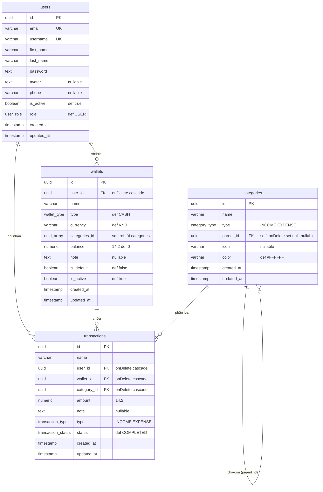

# Plan dựng Backend — My Finance Tracker (từ đầu / greenfield)

> Plan xây dựng toàn bộ backend API cho ứng dụng quản lý thu chi cá nhân, **giả định chưa có code**. Dùng để dựng lại dự án hoặc làm khung cho dự án tương tự. Mỗi phase đều ship được và kiểm thử độc lập.

---

## 1. Mục tiêu & phạm vi

API server cho web/app quản lý thu chi cá nhân:
- Người dùng đăng ký/đăng nhập, quản lý ví (wallets), danh mục (categories), giao dịch (transactions).
- Tổng hợp báo cáo (report) thu/chi theo thời gian, danh mục, ví.
- Admin quản lý user.
- Auth bằng JWT access + refresh, quên/đặt lại mật khẩu qua email.

**Ngoài phạm vi MVP** (để phase sau): budget/hạn mức, giao dịch định kỳ (recurring), thông báo realtime, upload ảnh (Cloudinary), export CSV/PDF.

## 2. Tech stack

| Layer | Công nghệ |
| --- | --- |
| Framework | NestJS 11 + TypeScript 5 (`strictNullChecks`) |
| Database | PostgreSQL 16 + Drizzle ORM (driver `postgres.js`) |
| Cache/Token store | Redis 7 (ioredis) |
| Auth | Passport JWT (access + refresh) |
| Validation | Zod v4 qua custom `ZodValidationPipe` |
| Email | Nodemailer (`@nestjs-modules/mailer`) |
| API docs | `@nestjs/swagger` |
| Runtime/PM | Bun (runtime) + npm/bun lockfile |
| Test | Jest (unit) + Supertest (e2e) |
| Chất lượng | ESLint + Prettier (single quote, trailing comma, width 100) |
| Hạ tầng | Docker/Podman Compose |

## 3. Kiến trúc & luồng request

```
Request
  → Global JwtAuthGuard  (bỏ qua nếu @Public)
  → Controller (@Body/@Query qua ZodValidationPipe)
  → Service (business logic)
  → Repository (Drizzle queries)  ── optional cho domain phức tạp
  → PostgreSQL
  → ResponseInterceptor bọc { statusCode, message, data, timestamp, method, path }
  → (lỗi) ErrorInterceptor + HttpExceptionFilter
```

Nguyên tắc:
- Mỗi feature = `module + controller + service` (+ `repository` khi cần query phức tạp).
- DB inject qua string token `'DRIZZLE'` (không import Drizzle trực tiếp).
- DTO/validation đặt ở `src/packages/entities/{domain}/` (Zod schema + TS type).
- Path alias **chỉ** `@packages/*` → `src/packages/*`; trong `features/` dùng relative import.

## 4. Phase 0 — Scaffold & hạ tầng

1. `nest new` (hoặc khởi tạo thủ công), bật TypeScript strictNullChecks, cấu hình `tsconfig.json` path alias `@packages/* → src/packages/*`.
2. Cấu hình ESLint (typescript-eslint) + Prettier + script: `start:dev`, `build`, `lint`, `format`, `test`, `test:e2e`.
3. `docker-compose.yml`:
   - PostgreSQL 16-alpine → host port **5433** (tránh đụng 5432 local), volume `postgres_data`, healthcheck `pg_isready`.
   - Redis 7-alpine → host port **6380**.
4. `.env.example` + `.env` (xem mục 11). Dùng `@nestjs/config` `ConfigModule.forRoot({ isGlobal: true })`.
5. `main.ts` bootstrap: `enableCors({ origin: true, credentials: true })`, global interceptors (Response, Error, Logger), global `HttpExceptionFilter`, `listen(PORT ?? 8888)`.

## 5. Phase 1 — Database & migrations

`src/database/`:
- `database.module.ts`: `@Global` provider tạo `postgres()` client + `drizzle()`, export token `'DRIZZLE'`. Resolve connection từ `DATABASE_URL` hoặc ghép từ `POSTGRES_*`.
- `schema.ts`: toàn bộ table trong 1 file.

### Enums
`user_role` (USER, ADMIN, MODERATOR) · `category_type` (INCOME, EXPENSE) · `wallet_type` (CASH, BANK, E_WALLET, CREDIT) · `transaction_type` (INCOME, EXPENSE) · `transaction_status` (PENDING, COMPLETED, CANCELLED).

### Tables (UUID PK, `defaultRandom`)
- **users**: email (unique, 255), username (unique, 50), firstName, lastName, password (hash), avatar?, phone?, isActive (def true), role (def USER), createdAt, updatedAt.
- **categories**: name (100), type, parentId → self FK `onDelete: set null` (danh mục cha-con), icon?, color (7, def `#FFFFFF`), timestamps. **Unique index** (name, type, parentId).
- **wallets**: userId → users `cascade`, name (100), type (def CASH), currency (3, def VND), categoriesId `uuid[]` (def `{}`), balance `numeric(14,2)` (def 0), note?, isDefault (def false), isActive (def true), timestamps. **Unique index** (userId, name).
- **transactions**: name (100), userId/walletId/categoryId → FK `cascade`, amount `numeric(14,2)`, note?, type, status (def COMPLETED), timestamps. **Index** trên userId, walletId, categoryId, createdAt.

### Sơ đồ ERD



**Quan hệ & ràng buộc:**
- `users 1—N wallets` / `users 1—N transactions` / `wallets 1—N transactions` / `categories 1—N transactions` — đều FK `onDelete: cascade` (xoá user/ví/danh mục kéo theo giao dịch liên quan).
- `categories 1—N categories` qua `parent_id` (self-FK, `onDelete: set null`) — danh mục cha-con.
- `wallets.categories_id` (`uuid[]`) là **soft reference** tới `categories` (danh mục được phép dùng với ví) — **không phải FK cứng**, app tự đảm bảo toàn vẹn.
- **Unique index**: `categories(name, type, parent_id)` · `wallets(user_id, name)`.
- **Index** (transactions): `user_id`, `wallet_id`, `category_id`, `created_at`.

### Migration rules
- Sửa schema **chỉ** trong `schema.ts` → `db:generate` (sinh SQL trong `drizzle/`) → `db:migrate`.
- `db:push` chỉ dùng local dev.
- ⚠️ Tránh đổi kiểu cột PK sau khi đã tạo (vd `serial` → `uuid` không auto-cast được, làm hỏng cả chuỗi migration). **Thiết kế PK là `uuid` ngay từ migration đầu.**

## 6. Phase 2 — Shared packages layer (`src/packages/`)

Dựng trước khi viết feature, vì tất cả feature phụ thuộc:

| Thư mục | Nội dung |
| --- | --- |
| `pipes/` | `ZodValidationPipe<T>` — parse `@Body`/`@Query` bằng Zod schema, ném `BadRequestException` khi sai. |
| `interceptor/` | `ResponseInterceptor` (bọc response chuẩn + đọc message từ `@ApiResponse`), `ErrorInterceptor`, `LoggerInterceptor`. |
| `filters/` | `HttpExceptionFilter` global. |
| `guards/` | `JwtAuthGuard` (global qua `APP_GUARD`, verify access token, set `req.user`), `AdminRoleGuard` (check `role === 'ADMIN'`). |
| `decorators/` | `@Public()` (bỏ qua JwtAuthGuard), `@CurrentUser()` (lấy user từ JWT), `@ApiResponse({ statusCode, message })`. |
| `helpers/` | `hashingData` (bcrypt), `jwt.helper` (sign/verify access+refresh, type payload), `queryList.helper` (phân trang/sort/filter). |
| `strategy/` | `JwtUserStrategy` (Passport) nếu dùng Passport; hoặc verify thủ công trong guard. |
| `configs/` | cấu hình ký JWT (secret + TTL). |
| `interfaces/` | `ApiResponseInterface`, `UserInterface`. |
| `entities/{domain}/` | Zod schema + TS type cho từng domain. |

**JWT payload**: access `{ sub, email, typ:'access', role }`, refresh `{ sub, email, typ:'refresh' }`. Secret riêng cho access/refresh (UUID v4 trong `.env`).

## 7. Phase 3 — Auth + User

Build cùng nhau (auth phụ thuộc user store).

### User module
- `users` CRUD; service inject `'DRIZZLE'`.
- Endpoints: `GET /users` (list phân trang + search + filter role/isActive, kèm đếm wallet/transaction/category), `GET /users/detail-user` (chi tiết, `include` wallets/transactions/categories), `GET /users/get-by-field`, `POST /users` (admin tạo), `PUT /users` (tự cập nhật), `PUT /users/:id` (admin), `PUT /users/:id/status` (toggle isActive), `DELETE /users/:id` (admin).

### Auth module
- `POST /auth/register` — tạo user (hash password, check trùng email/username).
- `POST /auth/login` — verify password, ký access + refresh, lưu refresh token vào Redis key `auth:refresh:{userId}` TTL 7d.
- `POST /auth/refresh` — verify refresh token → cấp cặp token mới.
- `POST /auth/forgot-password` — sinh token reset, lưu Redis, gửi email link `${FRONTEND_RESET_URL_BASE}/reset-password?token=...`. Dev không có SMTP vẫn trả 200 + log link.
- `POST /auth/reset-password` — verify token reset → đổi mật khẩu.
- Tất cả route auth gắn `@Public()`.
- Global guard `JwtAuthGuard` đăng ký ở `AppModule` qua `APP_GUARD`.

## 8. Phase 4 — Category

- CRUD danh mục, hỗ trợ cha-con (`parentId`), phân loại INCOME/EXPENSE.
- Repository xử lý unique (name, type, parentId).
- Endpoints: `POST /category`, `GET /category/:id`, `PUT /category/:id`, `DELETE /category/:id` (+ list nếu cần).

## 9. Phase 5 — Wallet

- Mỗi user nhiều ví; `isDefault` đánh dấu ví mặc định; `balance` numeric.
- `categoriesId` (uuid[]) gắn danh mục cho phép dùng với ví.
- Unique (userId, name). Repository cho query theo user.
- Endpoints: `POST /wallets`, `GET /wallets`, `GET /wallets/:id`, `PUT /wallets/:id`, `DELETE /wallets/:id`.

## 10. Phase 6 — Transaction (+ cập nhật số dư)

- CRUD giao dịch gắn user/wallet/category, `amount` numeric, `type` INCOME/EXPENSE, `status`.
- **Balance**: mỗi khi tạo/sửa/xoá giao dịch COMPLETED → cập nhật lại `wallets.balance` (INCOME cộng, EXPENSE trừ). Tách logic tính số dư ra `transaction.balance.ts` để tái dùng & test.
  - Chạy trong **transaction DB** để đồng bộ (giao dịch + cập nhật ví atomic).
  - Cân nhắc recompute toàn bộ ví từ tổng giao dịch để tránh sai lệch tích lũy.
- Repository: query list phân trang + filter (wallet, category, type, status, khoảng ngày).
- Endpoints: `POST /transactions`, `GET /transactions`, `GET /transactions/:id`, `PUT /transactions/:id`, `DELETE /transactions/:id`.

## 11. Phase 7 — Report

Tổng hợp đọc-only từ transactions (join wallet/category), scope theo user.
- `GET /reports/summary` — tổng thu/chi/số dư ròng theo khoảng thời gian.
- `GET /reports/by-category` — gộp theo danh mục.
- `GET /reports/trend` — chuỗi thời gian (theo ngày/tuần/tháng).
- `GET /reports/by-wallet` — gộp theo ví.
- Repository dùng aggregate SQL (`sum`, `count`, `group by`). Lưu ý ép `numeric` → number/string đúng cách.

## 12. Phase 8 — Email & Redis (hạ tầng dùng chung)

- **Email**: `MailerModule` (Nodemailer) cấu hình từ `MAIL_*`; service gửi mail reset password / thông báo. Dev thiếu SMTP → log cảnh báo, không fail.
- **Redis**: `RedisModule` `@Global`, `RedisService` wrap ioredis (`get/set/del` + expose `client` cho lệnh nâng cao). Dùng cho: refresh token store, reset-password token, rate-limit, presence (phase sau). Cấu hình `lazyConnect`, `maxRetriesPerRequest: null`.

## 13. Biến môi trường

| Nhóm | Biến |
| --- | --- |
| App | `NODE_ENV`, `PORT` (8888) |
| Postgres | `POSTGRES_HOST/PORT/DB/USER/PASSWORD`, `DATABASE_URL` |
| JWT | `JWT_ACCESS_SECRET`, `JWT_REFRESH_SECRET`, `JWT_ACCESS_EXPIRES_SECONDS` (10800), `JWT_REFRESH_EXPIRES_SECONDS` (604800) |
| Redis | `REDIS_HOST/PORT/PASSWORD` hoặc `REDIS_URL` |
| Mail | `MAIL_HOST/PORT/SECURE/USER/PASS/FROM`, `MAIL_SERVICE` |
| Frontend | `FRONTEND_RESET_URL_BASE` |

## 14. Testing

- **Unit** (`*.spec.ts` co-located): service/helper với mock `'DRIZZLE'` + Redis. Ưu tiên: auth (login/refresh/hash), transaction balance, report aggregate.
- **E2E** (`test/*.e2e-spec.ts`, Supertest): health-check trước; sau đó luồng auth → tạo wallet → tạo transaction → xem report. Cần DB test riêng (compose) hoặc testcontainer.
- Lệnh: `bun run test`, `bun run test:e2e`, `bun run test:cov`.
- Sau mỗi feature: `bun run lint:check && bun run test`.

## 15. Tooling & quy ước code

- Prettier: single quote, trailing comma (all), width 100, semicolon.
- Decorator order: `@Controller` → `@Public` → `@HttpCode` → `@ApiResponse` → method.
- Import shared qua `@packages/...`; local trong feature dùng relative.
- Swagger docs cho mọi endpoint.

## 16. Thứ tự milestone

| # | Milestone | Output ship được |
| --- | --- | --- |
| M0 | Scaffold + compose + config | Server chạy, health-check, DB+Redis up |
| M1 | DB schema + migrations + shared layer | Migrate sạch, interceptor/guard/pipe sẵn sàng |
| M2 | Auth + User | Đăng ký/đăng nhập/refresh/quên mật khẩu, admin quản lý user |
| M3 | Category | CRUD danh mục cha-con |
| M4 | Wallet | CRUD ví |
| M5 | Transaction + balance | Ghi giao dịch, số dư ví tự cập nhật |
| M6 | Report | 4 báo cáo tổng hợp |
| M7 | Email + Redis hoàn chỉnh | Reset password qua mail, token store |
| M8 | Test + Swagger + hardening | Coverage core, docs API, e2e luồng chính |

## 17. Rủi ro & gotchas (rút từ kinh nghiệm dự án)

- **PK phải là `uuid` từ migration đầu** — đổi `serial`→`uuid` sau này khiến `db:migrate` hỏng (Postgres không auto-cast integer→uuid).
- **`localhost` resolve IPv6 `::1`** trên Windows có thể làm CLI (drizzle-kit/seed/app) treo khi DB chỉ nghe IPv4 → dùng `127.0.0.1` trong `DATABASE_URL` khi chạy CLI local.
- **`numeric(14,2)`** trả về string từ `postgres.js` — luôn ép kiểu rõ ràng khi tính toán/serialize (balance, amount, aggregate).
- **Balance drift**: ưu tiên recompute ví từ tổng giao dịch trong DB transaction thay vì cộng/trừ tăng dần.
- **Refresh token** lưu Redis có TTL — nhớ xoá khi logout/đổi mật khẩu.

## 18. Mở rộng sau MVP (backlog)

Budget/hạn mức chi tiêu · giao dịch định kỳ (recurring) · upload avatar/biên lai (Cloudinary) · presence realtime admin (Socket.io — xem `docs/presence-module-plan.md`) · thông báo · export CSV/PDF · đa tiền tệ + tỉ giá · 2FA · audit log.
